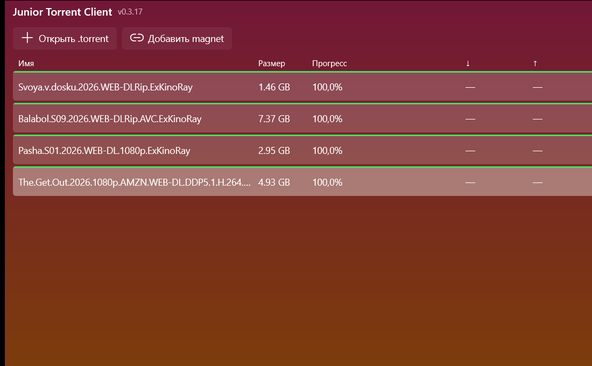

# Junior Torrent Client (JTC)

Минималистичный BitTorrent-клиент для Windows 11.
Свой pet-проект — только то, что реально нужно, ничего лишнего.

<p align="center">
  
</p>

<p align="center">
  
</p>

## Что умеет

- Скачивание из `.torrent` файлов и magnet-ссылок
- Список торрентов с прогрессом, скоростями DL/UL, числом пиров и состоянием
- Пауза, возобновление, удаление (с опцией удалить или оставить файлы)
- Лимит одновременных закачек — если он достигнут, лишние торренты стоят в очереди и запускаются автоматически, когда предыдущий завершается
- Ассоциация с `.torrent` файлами в Проводнике: правой кнопкой → **Открыть с помощью → JTC**
- Single-instance: второй запуск (например, из «Открыть с помощью») не плодит второе окно, а передаёт файл в уже открытое приложение
- Полностью русский интерфейс
- Собственный градиентный вид: pink → orange, стрелки логотипа продолжаются в цветовой палитре окна
- Подсветка строк по состоянию (скачивание / раздача / проверка / пауза / ошибка)
- Прогресс-бар в виде тонкой верхней грани каждой строки — растёт зелёным по мере скачивания

## Установка

**Готовый билд** (Release, самодостаточный, без установщика):

```powershell
git clone https://github.com/yalyoha/JTC.git
cd JTC
dotnet publish src/TClient -c Release -r win-x64 --self-contained
```

После этого в `src/TClient/bin/Release/net10.0-windows.../win-x64/publish/` появится папка со всеми файлами включая `TClient.exe` — переноси куда хочешь и запускай. Никаких `.msi`, `.msix`, установщиков, реестра HKLM или прав администратора не требуется.

Либо возьми готовый **инсталлятор** из [релизов](https://github.com/yalyoha/JTC/releases) — это Inno Setup, ставит в `%LocalAppData%\Programs\JTC`, добавляет ярлык в Пуск и деинсталлятор в «Программы и компоненты».

**Требования:**
- Windows 10 20H1+ (лучше Windows 11 — там красивее выглядит фон)
- .NET 10 SDK для сборки. Готовый билд уже включает всё что нужно, ставить .NET на конечной машине не надо

## Как пользоваться

1. Запусти `TClient.exe`
2. Первый раз нажми **Настройки** (⚙) → выбери папку для загрузок и лимит одновременных закачек (по умолчанию 3)
3. Дальше просто:
   - **+ Открыть .torrent** — выбор `.torrent` файла
   - **+ Добавить magnet** — вставка `magnet:?...` ссылки
   - Или правая кнопка на `.torrent` в Проводнике → **Открыть с помощью → JTC**
4. Кнопки справа (▶ / ❚❚ / 🗑) действуют на выделенный торрент:
   - **Возобновить** — запустить если стоит на паузе
   - **Пауза** — остановить закачку, соединения останутся
   - **Удалить** — с диалогом «удалить файлы с диска или оставить?»

## Где хранятся данные

Всё лежит в `%LocalAppData%\TClient\`:
- `settings.json` — папка загрузок и лимит закачек
- `torrents.json` — список текущих торрентов
- `cache/` — данные fast-resume от MonoTorrent (позволяет не перехешировать после перезапуска)
- `debug.log` — диагностический лог (ротируется на 1 МБ)
- `inbox/` — временные файлы обмена между экземплярами приложения

Чтобы «начать с нуля» — просто удали эту папку.

Историческое имя папки — от изначального названия проекта «TClient», сохранено для совместимости с существующим состоянием.

## Сборка из исходников (Debug)

```powershell
git clone https://github.com/yalyoha/JTC.git
cd JTC
dotnet build -c Release
dotnet run --project src/TClient
```

Тесты:
```powershell
dotnet test
```

## Стек

- **WinUI 3** (Windows App SDK) — GUI, unpackaged режим
- **MonoTorrent** — движок BitTorrent-протокола
- **CommunityToolkit.Mvvm** — MVVM-сокращалки
- **xUnit** — юнит-тесты
- **Inno Setup** — установщик
- **.NET 10** — рантайм

## Дизайн-документы

Исходные спека и план реализации (написаны при создании, на английском, для интересующихся деталями):

- Спецификация: [`docs/superpowers/specs/2026-07-11-tclient-design.md`](docs/superpowers/specs/2026-07-11-tclient-design.md)
- План реализации: [`docs/superpowers/plans/2026-07-11-tclient.md`](docs/superpowers/plans/2026-07-11-tclient.md)

## Лицензия

Личный проект, распространяется как есть. Пиши, если хочешь что-то добавить или нашёл баг — issues и PR приветствуются.
